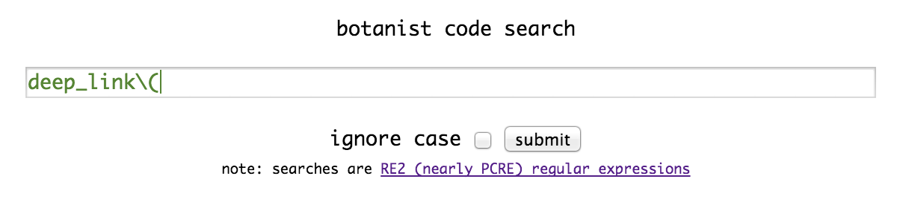
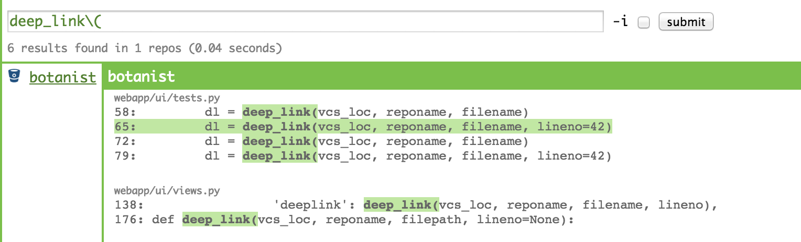
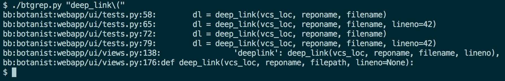

#botanist
a web and command-line code search tool for teams.

## web search




## command line search


#requirements

* an ubuntu server
* credentials for a user that has access to the repositories desired to be indexed (bitbucket.org and/or github.com) see: [Machine User](https://developer.github.com/guides/managing-deploy-keys/#machine-users)
* apache, nginx, or any other WSGI server for the Django webapp.

#build / installation

build and upload to target server:

```
make
scp botanist.tar.gz dest-server:
```

untar it on the target server, cd into the directory, and run `install.sh`

```
tar zxvf botanist.tar.gz
cd botanist
./install.sh

```

You'll have to setup the webapp and start it using your favorite webserver that supports WSGI (Apache, Nginx, Gunicorn, etc.)

The installation script sets up 2 periodic crons that run every half hour:

* one fetches new repositories or pulls the latest commits from bitbucket and/or github
* the other (re)indexes the source code using `cindex`

During the installation process, it will ask you what user to run things
as, as well as bitbucket and/or github credentials. It stores these
in a file that is only readable by the user it is installed under.

#packages

some software packages are included to make this work. they are included
in this repository for now for compatibility purposes.

##code search
The fast searching is made possible by the excellent codesearch tool
from Google:

https://code.google.com/p/codesearch/
(cindex running on a periodic cron to re-index)

##bitbucket repository fetching
https://github.com/samkuehn/bitbucket-backup
(running on a periodic cron to update the source code to search)
NOTE: Enclosed under ./packages is a custom fork of
samkeuhn/bitbucket-backup. I've issued several PR's that he's accepted
so he is really quick and amenable to updates, I just haven't quite
finished cleaning up the additions I made recently.

##github repository fetching
wrote up something to do this in Python based on
https://github.com/celeen/gitter

##pull requests welcome! checkout the TODOs file
